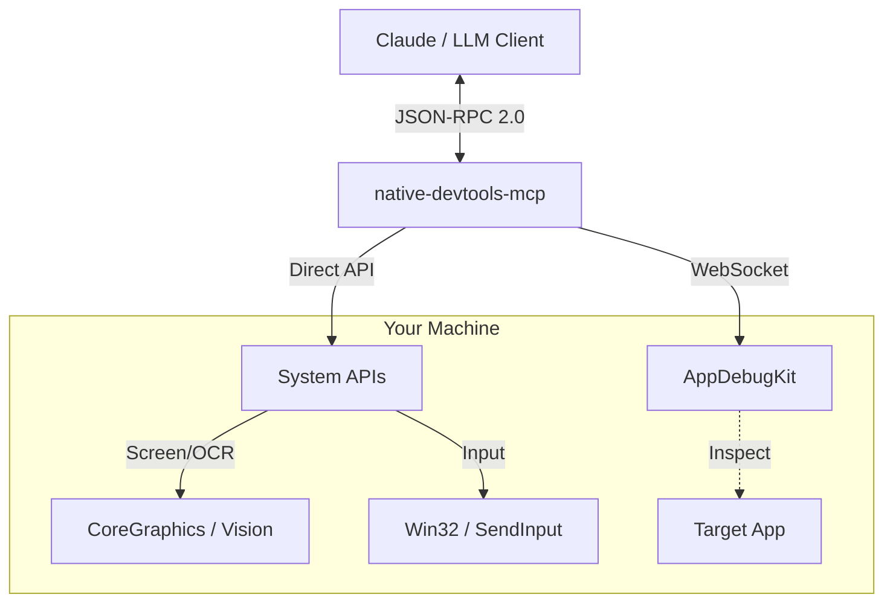

# native-devtools-mcp

<div align="center">


**Give your AI agent "eyes" and "hands" for native desktop applications.**

A Model Context Protocol (MCP) server that provides **Computer Use** capabilities: screenshots, OCR, input simulation, and window management.

[Features](#-features) • [Installation](#-installation) • [For AI Agents](#-for-ai-agents-llms) • [Permissions](#-required-permissions-macos)


</div>

---

## 🚀 Features

- **👀 Computer Vision:** Capture screenshots of screens, windows, or specific regions. Includes built-in OCR (text recognition) to "read" the screen.
- **🖱️ Input Simulation:** Click, drag, scroll, and type text naturally. Supports global coordinates and window-relative actions.
- **🪟 Window Management:** List open windows, find applications, and bring them to focus.
- **🔒 Local & Private:** 100% local execution. No screenshots or data are ever sent to external servers.
- **🔌 Dual-Mode Interaction:**
    1.  **Visual/Native:** Works with *any* app via screenshots & coordinates (Universal).
    2.  **AppDebugKit:** Deep integration for supported apps to inspect the UI tree (DOM-like structure).

## 🤖 For AI Agents (LLMs)

This MCP server is designed to be **highly discoverable and usable** by AI models (Claude, Gemini, GPT).

- **[📄 Read `agents.md`](./agents.md):** A compact, token-optimized technical reference designed specifically for ingestion by LLMs. It contains intent definitions, schema examples, and reasoning patterns.

**Core Capabilities for System Prompts:**
1.  `take_screenshot`: The "eyes". Returns images + layout metadata + text locations (OCR).
2.  `click` / `type_text`: The "hands". Interacts with the system based on visual feedback.
3.  `find_text`: A shortcut to find text on screen and get its coordinates immediately.

## 📦 Installation (macOS + Windows)

The install steps are identical on macOS and Windows.

### Option 1: Run with `npx` (no install needed)

```bash
npx -y native-devtools-mcp
```

### Option 2: Global install

```bash
npm install -g native-devtools-mcp
```

### Option 3: Build from source (Rust)

<details>
<summary>Click to expand build instructions</summary>

```bash
git clone https://github.com/sh3ll3x3c/native-devtools-mcp
cd native-devtools-mcp
cargo build --release
# Binary: ./target/release/native-devtools-mcp
```
</details>

## ⚙️ Configuration

### macOS Configuration

**Claude Desktop config file:** `~/Library/Application Support/Claude/claude_desktop_config.json`

**Claude Desktop requires the signed app bundle** (npx/npm will not work due to Gatekeeper):

1. Download `NativeDevtools-X.X.X.dmg` from [GitHub Releases](https://github.com/sh3ll3x3c/native-devtools-mcp/releases)
2. Open the DMG and drag `NativeDevtools.app` to `/Applications`
3. Configure Claude Desktop:

```json
{
  "mcpServers": {
    "native-devtools": {
      "command": "/Applications/NativeDevtools.app/Contents/MacOS/native-devtools-mcp"
    }
  }
}
```

4. Restart Claude Desktop - it will prompt for Screen Recording and Accessibility permissions for NativeDevtools

> **Note:** Claude Code (CLI) can use either the signed app or npx - both work.

### Windows Configuration

**Claude Desktop config file:** `%APPDATA%\Claude\claude_desktop_config.json`

### Configuration JSON (Windows and macOS CLI)

For Windows (or macOS with Claude Code CLI):

```json
{
  "mcpServers": {
    "native-devtools": {
      "command": "npx",
      "args": ["-y", "native-devtools-mcp"]
    }
  }
}
```

> **Note:** Requires Node.js 18+ installed.

### For Claude Code (CLI) Users

To avoid approving every single tool call (clicks, screenshots), you can add this wildcard permission to your project's settings or global config:

**File:** `.claude/settings.local.json` (or similar)

```json
{
  "permissions": {
    "allow": ["mcp__native-devtools__*"]
  }
}
```

## 🔍 Two Approaches to Interaction

We provide two ways for agents to interact, allowing them to choose the best tool for the job.

### 1. The "Visual" Approach (Universal)
**Best for:** 99% of apps (Electron, Qt, Games, Browsers).
*   **How it works:** The agent takes a screenshot, analyzes it visually (or uses OCR), and clicks at coordinates.
*   **Tools:** `take_screenshot`, `find_text`, `click`, `type_text`.
*   **Example:** "Click the button that looks like a gear icon."

### 2. The "Structural" Approach (AppDebugKit)
**Best for:** Apps specifically instrumented with our AppDebugKit library (mostly for developers testing their own apps).
*   **How it works:** The agent connects to a debug port and queries the UI tree (like HTML DOM).
*   **Tools:** `app_connect`, `app_query`, `app_click`.
*   **Example:** `app_click(element_id="submit-button")`.

## 🏗️ Architecture



<details>
<summary><strong>🔧 Technical Details (Under the Hood)</strong></summary>

| OS | Feature | API Used |
|----|---------|----------|
| **macOS** | Screenshots | `screencapture` (CLI) |
| | Input | `CGEvent` (CoreGraphics) |
| | OCR | `VNRecognizeTextRequest` (Vision Framework) |
| **Windows** | Screenshots | `BitBlt` (GDI) |
| | Input | `SendInput` (Win32) |
| | OCR | `Windows.Media.Ocr` (WinRT) |

### Screenshot Coordinate Precision

Screenshots include metadata for accurate coordinate conversion:

- `screenshot_origin_x/y`: Screen-space origin of the captured area (in points)
- `screenshot_scale`: Display scale factor (e.g., 2.0 for Retina displays)
- `screenshot_pixel_width/height`: Actual pixel dimensions of the image
- `screenshot_window_id`: Window ID (for window captures)

**Coordinate conversion:**
```
screen_x = screenshot_origin_x + (pixel_x / screenshot_scale)
screen_y = screenshot_origin_y + (pixel_y / screenshot_scale)
```

**Implementation notes:**
- **Window captures** (macOS): Uses `screencapture -o` which excludes window shadow. The captured image dimensions match `kCGWindowBounds × scale` exactly, ensuring click coordinates derived from screenshots land on intended UI elements.
- **Region captures**: Origin coordinates are aligned to integers to match the actual captured area.

</details>

## 🛡️ Privacy, Safety & Best Practices

### 🔒 Privacy First
*   **100% Local:** All processing (screenshots, OCR, logic) happens on your device.
*   **No Cloud:** Images are never uploaded to any third-party server by this tool.
*   **Open Source:** You can inspect the code to verify exactly what it does.

### ⚠️ Operational Safety
*   **Hands Off:** When the agent is "driving" (clicking/typing), **do not move your mouse or type**.
    *   *Why?* Real hardware inputs can conflict with the simulated ones, causing clicks to land in the wrong place.
*   **Focus Matters:** Ensure the window you want the agent to use is visible. If a popup steals focus, the agent might type into the wrong window unless it checks first.

## 🔐 Required Permissions (macOS)

On macOS, you must grant permissions to the **host application** (e.g., Terminal, VS Code, Claude Desktop) to allow screen recording and input control.

1.  **Screen Recording:** Required for `take_screenshot`.
    *   *System Settings > Privacy & Security > Screen Recording*
2.  **Accessibility:** Required for `click`, `type_text`, `scroll`.
    *   *System Settings > Privacy & Security > Accessibility*

> **Restart Required:** After granting permissions, you must fully quit and restart the host application.

## 🪟 Windows Notes

Works out of the box on **Windows 10/11**.
*   Uses standard Win32 APIs (GDI, SendInput).
*   OCR uses the built-in Windows Media OCR engine (offline).
*   **Note:** Cannot interact with "Run as Administrator" windows unless the MCP server itself is also running as Administrator.

## 📜 License

MIT © [sh3ll3x3c](https://github.com/sh3ll3x3c)
