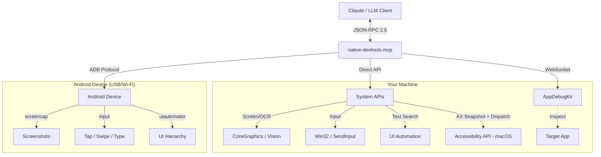

# native-devtools-mcp

`native-devtools-mcp` is a Model Context Protocol (MCP) server for computer use on macOS, Windows, and Android. It gives AI agents and MCP clients direct control over native desktop apps, Chrome/Electron browsers, and Android devices through screenshots, OCR, accessibility-based text lookup, input simulation, window management, Chrome DevTools Protocol (CDP), and ADB.

Use it when browser-only automation is not enough: Electron apps (Signal, Discord, VS Code), Chrome browser automation, system dialogs, desktop tools, native app testing, and Android device workflows. It works with [Claude Desktop](https://claude.ai/download), [Claude Code](https://docs.anthropic.com/en/docs/claude-code), [Cursor](https://cursor.com), and other MCP-compatible clients.

Useful for MCP-based computer use, desktop automation, browser automation, UI automation, native app testing, e2e testing, RPA, screen reading, mouse and keyboard control, Chrome DevTools Protocol automation, and Android device automation.

```bash
npx -y native-devtools-mcp
```

**Core capabilities**
- Screenshots, OCR, and accessibility-first `find_text`
- **Element-precise, focus-preserving automation (macOS):** `take_ax_snapshot` → `ax_click` / `ax_set_value` / `ax_select` — dispatch against Accessibility-tree elements without moving the mouse or stealing focus. Generation-tagged uids (`a<N>g<gen>`) make stale snapshots fail loud instead of silently targeting the wrong element.
- `click`, `type_text`, `scroll`, `launch_app`, `quit_app`, and window management
- `element_at_point` for inspecting accessible UI elements at screen coordinates
- `load_image` + `find_image` for non-text UI elements such as icons and custom controls
- Chrome/Electron automation via CDP: snapshots, click, fill, navigate, type, and tab management
- Android screenshots, text lookup, input, and app control over ADB
- Local execution: screenshots and input stay on the machine

**For AI agents:** Read [`AGENTS.md`](./AGENTS.md) for tool definitions, workflow patterns, and machine-readable usage guidance.


[Features](#-features) • [Installation](#-installation) • [Getting Started](#-getting-started) • [Recipes](#-recipes-and-examples) • [Security & Trust](#-security--trust) • [For AI Agents](#-for-ai-agents-llms) • [Chrome/Electron (CDP)](#-browser-automation-cdp) • [Android](#-android-support)

<div align="center">
<table>
<tr>
<td align="center"><strong>macOS</strong></td>
<td align="center"><strong>Windows</strong></td>
</tr>
<tr>
<td></td>
<td></td>
</tr>
</table>
</div>

---

## 🚀 Features

- **👀 Computer Vision:** Capture screenshots of screens, windows, or specific regions. Includes built-in OCR (text recognition) to "read" the screen.
- **🖱️ Input Simulation:** Click, drag, scroll, and type text naturally. Supports global coordinates and window-relative actions.
- **🪟 Window Management:** List open windows, find applications, and bring them to focus.
- **🧩 Template Matching:** Find non-text UI elements (icons, shapes) using `load_image` + `find_image`, returning precise click coordinates.
- **🔒 Local & Private:** 100% local execution. No screenshots or data are ever sent to external servers.
- **📱 Android Support:** Connect to Android devices over ADB for screenshots, input simulation, UI element search, and app management — all from the same MCP server.
- **🔍 Hover Tracking:** Track cursor hover transitions across UI elements in real-time. Configurable dwell threshold filters pass-through noise — designed for LLMs observing user navigation patterns.
- **🌐 Browser Automation (CDP):** Connect to Chrome/Electron apps via Chrome DevTools Protocol. Take accessibility tree snapshots, click elements by UID, evaluate JavaScript, and manage tabs — all without a separate Node.js server.
- **🔌 Multi-Mode Interaction:**
    1.  **Visual/Native:** Works with *any* app via screenshots & coordinates (Universal).
    2.  **AX Dispatch (macOS):** Element-precise, focus-preserving automation against the Accessibility tree — preferred for native macOS apps.
    3.  **CDP:** Connect to Chrome/Electron via `--remote-debugging-port` for DOM-level element targeting and JS evaluation.
    4.  **AppDebugKit:** Deep integration for supported apps to inspect the UI tree (DOM-like structure).

## 🤖 For AI Agents (LLMs)

This MCP server is designed to be **highly discoverable and usable** by AI models (Claude, Gemini, GPT).

- **[📄 Read `AGENTS.md`](./AGENTS.md):** A compact, token-optimized technical reference designed specifically for ingestion by LLMs. It contains intent definitions, schema examples, and reasoning patterns.

**Core Capabilities for System Prompts:**
1.  `take_screenshot`: The "eyes". Returns images + layout metadata + text locations (OCR).
2.  `click` / `type_text`: The "hands". Interacts with the system based on visual feedback.
3.  `find_text`: A shortcut to find text on screen and get its coordinates immediately. Uses the platform **accessibility API** (macOS Accessibility / Windows UI Automation) for precise element-level matching, with OCR fallback.
4.  `take_ax_snapshot` / `ax_click` / `ax_set_value` / `ax_select` (macOS): Element-precise, focus-preserving automation against the Accessibility tree. Snapshot returns a tree of generation-tagged uids (e.g. `a42g3`); dispatch primitives press buttons (`AXPress`), write text fields (`kAXValueAttribute`), and select rows (`AXSelectedRows`) without moving the mouse. **Preferred for native macOS apps.**
5.  `element_at_point`: Inspect the accessibility element at given screen coordinates — returns name, role, label, value, bounds, pid, and app_name. Note: privacy-focused Electron apps (e.g. Signal) may restrict their AX tree, returning only a container — use `take_screenshot` with OCR as a fallback.
6.  `load_image` / `find_image`: Template matching for non-text UI elements (icons, shapes), returning screen coordinates for clicking.
7.  `start_hover_tracking` / `get_hover_events` / `stop_hover_tracking`: Track cursor hover transitions across UI elements. Configurable dwell threshold filters pass-throughs.
8.  `start_recording` / `stop_recording`: Record the frontmost app's window at ~5fps as timestamped JPEG frames. Automatically follows app switches.
9.  `launch_app` / `quit_app`: Launch apps with optional CLI args, or gracefully/forcefully quit them.
10. `cdp_connect` / `cdp_take_ax_snapshot` / `cdp_take_dom_snapshot` / `cdp_find_elements` / `cdp_click` / `cdp_fill` / `cdp_navigate` / `cdp_element_at_point`: Connect to Chrome or Electron apps via CDP for DOM-level automation — snapshots, clicking, typing, navigation, element inspection, and tab management without a separate Node.js server.

### Element-precise AX dispatch (macOS, preferred for native apps)

```
take_ax_snapshot(app_name='System Settings')
  → tree with uids like `a42g3` (generation-tagged) and bboxes
ax_click(uid='a42g3')                          # press a button / menu item
ax_set_value(uid='a5g3', text='hello world')   # write a text field via kAXValueAttribute
ax_select(uid='a18g3')                         # select a sidebar / table row via AXSelectedRows
```

**Picking the right dispatch primitive:**

| Primitive | AX mechanism | Best for |
|-----------|--------------|----------|
| `ax_click` | `AXPress` action | Buttons, menu items, checkboxes, toolbar items |
| `ax_set_value` | write `kAXValueAttribute` | Text fields, search fields, stepper-backed inputs |
| `ax_select` | write `AXSelectedRows` | `NSOutlineView` / `NSTableView` row selection (sidebars, rule lists, file browsers) |

**Invalidation rule:** every fresh `take_ax_snapshot` bumps the generation. All uids from prior snapshots become stale immediately — `ax_click` / `ax_set_value` / `ax_select` will reject them with `snapshot_expired`. Snapshot immediately before you dispatch.

**When `ax_set_value` is not a substitute for typing:** `ax_set_value` writes `kAXValueAttribute` — it does not fire keydown/keyup, does not participate in IME composition, and does not populate the app's undo stack. If you need those semantics, fall back to `click(x, y)` + `type_text(text)` using the `fallback` bbox the tool returns on `not_dispatchable`.

## 📦 Installation

The install steps are identical on macOS and Windows.

### Option 1: Run with `npx` (no install needed)

```bash
npx -y native-devtools-mcp
```

### Option 2: Global install

```bash
npm install -g native-devtools-mcp
```

### Option 3: Build from source (Rust)

<details>
<summary>Click to expand build instructions</summary>

**Using the build script** (clones, builds, and runs setup):

```bash
curl -fsSL https://raw.githubusercontent.com/sh3ll3x3c/native-devtools-mcp/master/scripts/build-from-source.sh | bash
```

**Or manually:**

```bash
git clone https://github.com/sh3ll3x3c/native-devtools-mcp
cd native-devtools-mcp
cargo build --release
# Binary: ./target/release/native-devtools-mcp
```

</details>

## 🏁 Getting Started

After installing, run the setup wizard:

```bash
npx native-devtools-mcp setup
```

This will:
1. **Check permissions** (macOS) — verifies Accessibility and Screen Recording, opens System Settings if needed
2. **Detect your MCP clients** — finds Claude Desktop, Claude Code, Cursor
3. **Write the configuration** — generates the correct JSON config and offers to write it for you

Then restart your MCP client and you're ready to go.

> **Claude Desktop on macOS** requires the signed app bundle (Gatekeeper blocks npx). Download `NativeDevtools-X.X.X.dmg` from [GitHub Releases](https://github.com/sh3ll3x3c/native-devtools-mcp/releases), drag to `/Applications`, then run setup — it will detect the app and configure Claude Desktop to use it.

> **VS Code, Windsurf, and other clients:** `setup` doesn't auto-detect these yet. Run `setup` for the permission checks, then see the manual configuration below for the JSON config snippet.

> **Claude Code tip:** To avoid approving every tool call (clicks, screenshots), add this to `.claude/settings.local.json`:
> ```json
> { "permissions": { "allow": ["mcp__native-devtools__*"] } }
> ```

## 📚 Recipes and Examples

- [Recipes and Examples Index](./examples/README.md)
- [Claude Desktop Setup](./examples/claude-desktop-setup.md)
- [Claude Code Setup](./examples/claude-code-setup.md)
- [Cursor Setup](./examples/cursor-setup.md)
- [End-to-End Desktop Flow](./examples/end-to-end-desktop-flow.md)
- [Native App AX Dispatch Flow (macOS)](./examples/native-app-ax-dispatch-flow.md) — preferred for native macOS apps
- [Native App Click Flow](./examples/native-app-click-flow.md)
- [OCR Fallback and Element Inspection](./examples/ocr-fallback-and-element-inspection.md)
- [Template Matching Flow](./examples/template-matching-flow.md)
- [Android Quickstart](./examples/android-quickstart.md)

<details>
<summary><strong>Manual configuration (without setup)</strong></summary>

#### macOS — Claude Desktop

Config file: `~/Library/Application Support/Claude/claude_desktop_config.json`

```json
{
  "mcpServers": {
    "native-devtools": {
      "command": "/Applications/NativeDevtools.app/Contents/MacOS/native-devtools-mcp"
    }
  }
}
```

#### Windows — Claude Desktop

Config file: `%APPDATA%\Claude\claude_desktop_config.json`

#### Claude Code, Cursor, and other MCP clients

```json
{
  "mcpServers": {
    "native-devtools": {
      "command": "npx",
      "args": ["-y", "native-devtools-mcp"]
    }
  }
}
```

Requires Node.js 18+.

</details>

## 🔐 Security & Trust

This tool requires Accessibility and Screen Recording permissions — that's a lot of trust. Here's how to verify it deserves it.

### Verify your binary

```bash
native-devtools-mcp verify
```

Computes the SHA-256 hash of the running binary and checks it against the official checksums published on the [GitHub Releases](https://github.com/sh3ll3x3c/native-devtools-mcp/releases) page. If the hash matches, you're running an unmodified official build.

### Build from source

Don't trust pre-built binaries? Build it yourself:

```bash
curl -fsSL https://raw.githubusercontent.com/sh3ll3x3c/native-devtools-mcp/master/scripts/build-from-source.sh | bash
```

The script clones the repo, optionally opens it for review before building, compiles the release binary, and runs setup. See [`scripts/build-from-source.sh`](scripts/build-from-source.sh).

### Audit the code

[`SECURITY_AUDIT.md`](SECURITY_AUDIT.md) documents exactly which permissions are used, where in the source code, and includes an LLM audit prompt you can paste into any AI model to perform an independent security review.

### What this server does NOT do

- **No unsolicited network access** — the server never phones home. Network is only used when the MCP client explicitly invokes `app_connect` (WebSocket to a local debug server) or when you run the `verify` subcommand (fetches checksums from GitHub)
- **No file scanning** — does not read or index your files. The only file reads are `load_image` (reads a path the MCP client explicitly provides) and short-lived temp files for screenshots (deleted immediately after capture)
- **No background persistence** — exits when the MCP client disconnects
- **No data exfiltration** — screenshots are returned to the MCP client via stdout, never stored or transmitted elsewhere

## 🔍 Three Approaches to Interaction

We provide three ways for agents to interact with apps, so they can pick the best tool for the target.

### 1. The "Visual" Approach (Universal)
**Best for:** Any app — Electron, Qt, games, custom renderers, anything without a rich accessibility tree.
*   **How it works:** The agent takes a screenshot, analyzes it visually (or uses OCR), and clicks at coordinates.
*   **Tools:** `take_screenshot`, `find_text`, `click`, `type_text` (plus `load_image` / `find_image` for icons and shapes).
*   **Example:** "Click the button that looks like a gear icon." → use `find_image` with a gear template.

### 2. The "Structural (AX)" Approach (macOS native apps — preferred)
**Best for:** Native macOS apps (AppKit / SwiftUI) — System Settings, Finder, Mail, Xcode, Notes, most App Store apps.
*   **How it works:** The agent takes an Accessibility-tree snapshot, picks an element by uid, and dispatches an AX action — no mouse movement, no focus steal. Generation-tagged uids make stale snapshots fail loud.
*   **Tools:** `take_ax_snapshot`, `ax_click`, `ax_set_value`, `ax_select` (plus `element_at_point` for inspection).
*   **Example:** `take_ax_snapshot(app_name="System Settings")` → `ax_click(uid="a42g3")`.

### 3. The "Structural" Approach (AppDebugKit)
**Best for:** Apps specifically instrumented with our AppDebugKit library (mostly for developers testing their own apps).
*   **How it works:** The agent connects to a debug port and queries the UI tree (like HTML DOM).
*   **Tools:** `app_connect`, `app_query`, `app_click`.
*   **Example:** `app_click(element_id="submit-button")`.

## 🧩 Template Matching (find_image)

Use `find_image` when the target is **not text** (icons, toggles, custom controls) and OCR or `find_text` cannot identify it.

**Typical flow:**
1. `take_screenshot(app_name="MyApp")` → `screenshot_id`
2. `load_image(path="/path/to/icon.png")` → `template_id`
3. `find_image(screenshot_id="...", template_id="...")` → `matches` with `screen_x/screen_y`
4. `click(x=..., y=...)`

**Fast vs Accurate:**
- **fast** (default): uses downscaling and early-exit for speed.
- **accurate**: uses full-resolution, wider scale search, and smaller stride for thorough matching.

Optional inputs like `mask_id`, `search_region`, `scales`, and `rotations` can improve precision and performance.

## 🌐 Browser Automation (CDP)

Connect to Chrome or Electron apps via the Chrome DevTools Protocol for DOM-level automation — more reliable than coordinate-based clicking for web content.

```bash
# Launch Chrome with remote debugging
launch_app(app_name="Google Chrome", args=["--remote-debugging-port=9222", "--user-data-dir=/tmp/chrome-profile"])

# Connect and automate
cdp_connect(port=9222)
cdp_navigate(url="https://example.com")
cdp_take_ax_snapshot()        # accessibility tree with element UIDs (a1, a2, ...)
cdp_fill(uid="a10", value="search query")
cdp_press_key(key="Enter")
cdp_wait_for(text=["Results"])
```

**19 CDP tools** — snapshot (AX + DOM), find elements, click, hover, fill, type, press key, navigate, handle dialogs, manage tabs, evaluate JS, element inspection, and more. Works with Chrome 136+, Chromium, and Electron apps (Signal, Discord, VS Code, Slack). See [`AGENTS.md`](./AGENTS.md) for full tool reference.

**Chrome 136+ note:** Requires `--user-data-dir=<path>` alongside `--remote-debugging-port` (Chrome silently ignores the debug port with the default profile). Electron apps only need `--remote-debugging-port`.

## 📱 Android Support

Android support is built-in. The MCP server communicates with Android devices over ADB (USB or Wi-Fi), providing screenshots, input simulation, UI element search, and app management.

### Prerequisites

1. **ADB installed** on the host machine (`brew install android-platform-tools` on macOS, or install via [Android SDK](https://developer.android.com/tools/releases/platform-tools))
2. **USB debugging enabled** on the Android device (Settings > Developer options > USB debugging)
3. **ADB server running** — starts automatically when you run `adb devices`

### Android tools

All Android tools are prefixed with `android_` and appear dynamically after connecting to a device:

| Tool | Description |
|------|-------------|
| `android_list_devices` | List all ADB-connected devices (always available) |
| `android_connect` | Connect to a device by serial number |
| `android_disconnect` | Disconnect from the current device |
| `android_screenshot` | Capture the device screen |
| `android_find_text` | Find UI elements by text (via uiautomator) |
| `android_click` | Tap at screen coordinates |
| `android_swipe` | Swipe between two points |
| `android_type_text` | Type text on the device |
| `android_press_key` | Press a key (e.g., `KEYCODE_HOME`, `KEYCODE_BACK`) |
| `android_launch_app` | Launch an app by package name |
| `android_list_apps` | List installed packages |
| `android_get_display_info` | Get screen resolution and density |
| `android_get_current_activity` | Get the current foreground activity |

### Typical workflow

```
android_list_devices          → find your device serial
android_connect(serial="...")  → connect (unlocks android_* tools)
android_screenshot            → see what's on screen
android_find_text(text="OK")  → locate a button
android_click(x=..., y=...)   → tap it
```

### Known issues

> **MIUI / HyperOS (Xiaomi, Redmi, POCO devices):** Input injection (`android_click`, `android_type_text`, `android_press_key`, `android_swipe`) and `android_find_text` (via uiautomator) require an additional security toggle:
>
> **Settings > Developer options > USB debugging (Security settings)** — enable this toggle. MIUI may require you to sign in with a Mi account to enable it.
>
> Without this, you'll see `INJECT_EVENTS permission` errors for input tools and `could not get idle state` errors for `android_find_text`. Screenshot and device info tools work without this toggle.

> **Wireless ADB:** To connect without a USB cable, first connect via USB and run:
> ```bash
> adb tcpip 5555
> adb connect <phone-ip>:5555
> ```
> Then use the `<phone-ip>:5555` serial in `android_connect`.

### Smoke tests

Smoke tests verify all Android tools against a real connected device. They are `#[ignore]`d by default and must be run explicitly:

```bash
cargo test --test android_smoke_tests -- --ignored --test-threads=1
```

Tests must run sequentially (`--test-threads=1`) since they share a single physical device. The device must be unlocked and awake.

## 🏗️ Architecture



<details>
<summary><strong>🔧 Technical Details (Under the Hood)</strong></summary>

| OS | Feature | API Used |
|----|---------|----------|
| **macOS** | Screenshots | `screencapture` (CLI) |
| | Input | `CGEvent` (CoreGraphics) |
| | Text Search (`find_text`) | `Accessibility API` (primary), Vision OCR (fallback) |
| | AX Snapshot + Dispatch (`take_ax_snapshot` / `ax_click` / `ax_set_value` / `ax_select`) | Accessibility API — AX tree walk, `AXPress` action, `kAXValueAttribute` write, `AXSelectedRows` write (focus-preserving, no mouse movement) |
| | Element Inspection (`element_at_point`) | `AXUIElementCopyElementAtPosition` + AX tree walk fallback (Accessibility API) |
| | Hover Tracking (`start_hover_tracking`) | `CGEvent` cursor + Accessibility API polling |
| | Screen Recording (`start_recording`) | `CGWindowListCreateImage` at configurable fps |
| | OCR | `VNRecognizeTextRequest` (Vision Framework) |
| **Windows** | Screenshots | `BitBlt` (GDI) |
| | Input | `SendInput` (Win32) |
| | Text Search (`find_text`) | `UI Automation` (primary), WinRT OCR (fallback) |
| | Element Inspection (`element_at_point`) | `IUIAutomation::ElementFromPoint` (UI Automation) |
| | Hover Tracking (`start_hover_tracking`) | `GetCursorPos` + UI Automation polling |
| | Screen Recording (`start_recording`) | `BitBlt` (GDI) at configurable fps |
| | OCR | `Windows.Media.Ocr` (WinRT) |
| **Android** | Screenshots | `screencap` / ADB framebuffer |
| | Input | `adb shell input` (tap, swipe, text, keyevent) |
| | Text Search (`find_text`) | `uiautomator dump` (accessibility tree) |
| | Device Communication | `adb_client` crate (native Rust ADB protocol) |

### Screenshot Coordinate Precision

Screenshots include metadata for accurate coordinate conversion:

- `screenshot_origin_x/y`: Screen-space origin of the captured area (in points)
- `screenshot_scale`: Display scale factor (e.g., 2.0 for Retina displays)
- `screenshot_pixel_width/height`: Actual pixel dimensions of the image
- `screenshot_window_id`: Window ID (for window captures)

**Coordinate conversion:**
```
screen_x = screenshot_origin_x + (pixel_x / screenshot_scale)
screen_y = screenshot_origin_y + (pixel_y / screenshot_scale)
```

**Implementation notes:**
- **Window captures** (macOS): Uses `screencapture -o` which excludes window shadow. The captured image dimensions match `kCGWindowBounds × scale` exactly, ensuring click coordinates derived from screenshots land on intended UI elements.
- **Region captures**: Origin coordinates are aligned to integers to match the actual captured area.

</details>

## ⚠️ Operational Safety

*   **Hands Off:** When the agent is "driving" (clicking/typing), **do not move your mouse or type**.
    *   *Why?* Real hardware inputs can conflict with the simulated ones, causing clicks to land in the wrong place.
*   **Focus Matters:** Ensure the window you want the agent to use is visible. If a popup steals focus, the agent might type into the wrong window unless it checks first.

## 🪟 Windows Notes

Works out of the box on **Windows 10/11**.
*   Uses standard Win32 APIs (GDI, SendInput).
*   `find_text` uses **UI Automation (UIA)** as the primary search mechanism, querying the accessibility tree for element names. This is the same accessibility-first approach used on macOS (with the Accessibility API). Falls back to OCR automatically when UIA finds no matches.
*   OCR uses the built-in Windows Media OCR engine (offline).
*   **Note:** Cannot interact with "Run as Administrator" windows unless the MCP server itself is also running as Administrator.
*   **Screen Recording Performance:** Screen recording uses GDI/BitBlt at configurable fps (default 5). For higher fps requirements or game capture scenarios, DXGI Desktop Duplication API would provide hardware-accelerated capture — this is a planned future upgrade.

## ⭐ Star History

<a href="https://www.star-history.com/?repos=sh3ll3x3c%2Fnative-devtools-mcp&type=date&legend=bottom-right">
 <picture>
   <source media="(prefers-color-scheme: dark)" srcset="https://api.star-history.com/chart?repos=sh3ll3x3c/native-devtools-mcp&type=date&theme=dark&legend=bottom-right" />
   <source media="(prefers-color-scheme: light)" srcset="https://api.star-history.com/chart?repos=sh3ll3x3c/native-devtools-mcp&type=date&legend=bottom-right" />
   
 </picture>
</a>

## 📜 License

MIT © [sh3ll3x3c](https://github.com/sh3ll3x3c)
