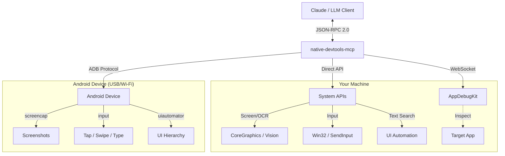

# native-devtools-mcp

<div align="center">


**Give your AI agent "eyes" and "hands" for native desktop and mobile applications.**

A Model Context Protocol (MCP) server that provides **Computer Use** capabilities: screenshots, OCR, input simulation, and window management — for **native desktop apps** and **Android devices**, not just browsers.

**Works with:** [Claude Desktop](https://claude.ai/download) • [Claude Code](https://docs.anthropic.com/en/docs/claude-code) • [Cursor](https://cursor.com) • Any MCP-compatible client

[//]: # "Search keywords: MCP, MCP server, Model Context Protocol, computer use, desktop automation, UI automation, native app testing, test automation, e2e testing, RPA, screenshots, OCR, template matching, accessibility, mouse, keyboard, screen reading, macOS, Windows, Android, ADB, mobile testing, Claude, Claude Code, Cursor, AI agent, native-devtools-mcp"

[Features](#-features) • [Installation](#-installation) • [For AI Agents](#-for-ai-agents-llms) • [Android](#-android-support) • [Permissions](#-required-permissions-macos)

<table>
<tr>
<td align="center"><strong>macOS</strong></td>
<td align="center"><strong>Windows</strong></td>
</tr>
<tr>
<td></td>
<td></td>
</tr>
</table>

</div>

---

## 🚀 Features

- **👀 Computer Vision:** Capture screenshots of screens, windows, or specific regions. Includes built-in OCR (text recognition) to "read" the screen.
- **🖱️ Input Simulation:** Click, drag, scroll, and type text naturally. Supports global coordinates and window-relative actions.
- **🪟 Window Management:** List open windows, find applications, and bring them to focus.
- **🧩 Template Matching:** Find non-text UI elements (icons, shapes) using `load_image` + `find_image`, returning precise click coordinates.
- **🔒 Local & Private:** 100% local execution. No screenshots or data are ever sent to external servers.
- **📱 Android Support:** Connect to Android devices over ADB for screenshots, input simulation, UI element search, and app management — all from the same MCP server.
- **🔌 Dual-Mode Interaction:**
    1.  **Visual/Native:** Works with *any* app via screenshots & coordinates (Universal).
    2.  **AppDebugKit:** Deep integration for supported apps to inspect the UI tree (DOM-like structure).

## 🤖 For AI Agents (LLMs)

This MCP server is designed to be **highly discoverable and usable** by AI models (Claude, Gemini, GPT).

- **[📄 Read `AGENTS.md`](./AGENTS.md):** A compact, token-optimized technical reference designed specifically for ingestion by LLMs. It contains intent definitions, schema examples, and reasoning patterns.

**Core Capabilities for System Prompts:**
1.  `take_screenshot`: The "eyes". Returns images + layout metadata + text locations (OCR).
2.  `click` / `type_text`: The "hands". Interacts with the system based on visual feedback.
3.  `find_text`: A shortcut to find text on screen and get its coordinates immediately. Uses the platform **accessibility API** (macOS Accessibility / Windows UI Automation) for precise element-level matching, with OCR fallback.
4.  `load_image` / `find_image`: Template matching for non-text UI elements (icons, shapes), returning screen coordinates for clicking.

## 📦 Installation

The install steps are identical on macOS and Windows.

### Option 1: Run with `npx` (no install needed)

```bash
npx -y native-devtools-mcp
```

### Option 2: Global install

```bash
npm install -g native-devtools-mcp
```

### Option 3: Build from source (Rust)

<details>
<summary>Click to expand build instructions</summary>

```bash
git clone https://github.com/sh3ll3x3c/native-devtools-mcp
cd native-devtools-mcp
cargo build --release
# Binary: ./target/release/native-devtools-mcp
```

To include Android device support, enable the `android` feature flag:

```bash
cargo build --release --features android
```
</details>

## ⚙️ Configuration

### macOS Configuration

**Claude Desktop config file:** `~/Library/Application Support/Claude/claude_desktop_config.json`

**Claude Desktop requires the signed app bundle** (npx/npm will not work due to Gatekeeper):

1. Download `NativeDevtools-X.X.X.dmg` from [GitHub Releases](https://github.com/sh3ll3x3c/native-devtools-mcp/releases)
2. Open the DMG and drag `NativeDevtools.app` to `/Applications`
3. Configure Claude Desktop:

```json
{
  "mcpServers": {
    "native-devtools": {
      "command": "/Applications/NativeDevtools.app/Contents/MacOS/native-devtools-mcp"
    }
  }
}
```

4. Restart Claude Desktop - it will prompt for Screen Recording and Accessibility permissions for NativeDevtools

> **Note:** Claude Code (CLI) can use either the signed app or npx - both work.

### Windows Configuration

**Claude Desktop config file:** `%APPDATA%\Claude\claude_desktop_config.json`

### Configuration JSON (Windows and macOS CLI)

For Windows (or macOS with Claude Code CLI):

```json
{
  "mcpServers": {
    "native-devtools": {
      "command": "npx",
      "args": ["-y", "native-devtools-mcp"]
    }
  }
}
```

> **Note:** Requires Node.js 18+ installed.

### For Claude Code (CLI) Users

To avoid approving every single tool call (clicks, screenshots), you can add this wildcard permission to your project's settings or global config:

**File:** `.claude/settings.local.json` (or similar)

```json
{
  "permissions": {
    "allow": ["mcp__native-devtools__*"]
  }
}
```

## 🔍 Two Approaches to Interaction

We provide two ways for agents to interact, allowing them to choose the best tool for the job.

### 1. The "Visual" Approach (Universal)
**Best for:** 99% of apps (Electron, Qt, Games, Browsers).
*   **How it works:** The agent takes a screenshot, analyzes it visually (or uses OCR), and clicks at coordinates.
*   **Tools:** `take_screenshot`, `find_text`, `click`, `type_text` (plus `load_image` / `find_image` for icons and shapes).
*   **Example:** "Click the button that looks like a gear icon." → use `find_image` with a gear template.

### 2. The "Structural" Approach (AppDebugKit)
**Best for:** Apps specifically instrumented with our AppDebugKit library (mostly for developers testing their own apps).
*   **How it works:** The agent connects to a debug port and queries the UI tree (like HTML DOM).
*   **Tools:** `app_connect`, `app_query`, `app_click`.
*   **Example:** `app_click(element_id="submit-button")`.

## 🧩 Template Matching (find_image)

Use `find_image` when the target is **not text** (icons, toggles, custom controls) and OCR or `find_text` cannot identify it.

**Typical flow:**
1. `take_screenshot(app_name="MyApp")` → `screenshot_id`
2. `load_image(path="/path/to/icon.png")` → `template_id`
3. `find_image(screenshot_id="...", template_id="...")` → `matches` with `screen_x/screen_y`
4. `click(x=..., y=...)`

**Fast vs Accurate:**
- **fast** (default): uses downscaling and early-exit for speed.
- **accurate**: uses full-resolution, wider scale search, and smaller stride for thorough matching.

Optional inputs like `mask_id`, `search_region`, `scales`, and `rotations` can improve precision and performance.

## 📱 Android Support

Android support is available as an optional feature flag. It lets the MCP server communicate with Android devices over ADB (USB or Wi-Fi), providing screenshots, input simulation, UI element search, and app management.

### Prerequisites

1. **ADB installed** on the host machine (`brew install android-platform-tools` on macOS, or install via [Android SDK](https://developer.android.com/tools/releases/platform-tools))
2. **USB debugging enabled** on the Android device (Settings > Developer options > USB debugging)
3. **ADB server running** — starts automatically when you run `adb devices`

### Building with Android support

```bash
cargo build --release --features android
```

### Android tools

All Android tools are prefixed with `android_` and appear dynamically after connecting to a device:

| Tool | Description |
|------|-------------|
| `android_list_devices` | List all ADB-connected devices (always available) |
| `android_connect` | Connect to a device by serial number |
| `android_disconnect` | Disconnect from the current device |
| `android_screenshot` | Capture the device screen |
| `android_find_text` | Find UI elements by text (via uiautomator) |
| `android_click` | Tap at screen coordinates |
| `android_swipe` | Swipe between two points |
| `android_type_text` | Type text on the device |
| `android_press_key` | Press a key (e.g., `KEYCODE_HOME`, `KEYCODE_BACK`) |
| `android_launch_app` | Launch an app by package name |
| `android_list_apps` | List installed packages |
| `android_get_display_info` | Get screen resolution and density |
| `android_get_current_activity` | Get the current foreground activity |

### Typical workflow

```
android_list_devices          → find your device serial
android_connect(serial="...")  → connect (unlocks android_* tools)
android_screenshot            → see what's on screen
android_find_text(text="OK")  → locate a button
android_click(x=..., y=...)   → tap it
```

### Known issues

> **MIUI / HyperOS (Xiaomi, Redmi, POCO devices):** Input injection (`android_click`, `android_type_text`, `android_press_key`, `android_swipe`) and `android_find_text` (via uiautomator) require an additional security toggle:
>
> **Settings > Developer options > USB debugging (Security settings)** — enable this toggle. MIUI may require you to sign in with a Mi account to enable it.
>
> Without this, you'll see `INJECT_EVENTS permission` errors for input tools and `could not get idle state` errors for `android_find_text`. Screenshot and device info tools work without this toggle.

> **Wireless ADB:** To connect without a USB cable, first connect via USB and run:
> ```bash
> adb tcpip 5555
> adb connect <phone-ip>:5555
> ```
> Then use the `<phone-ip>:5555` serial in `android_connect`.

### Smoke tests

Smoke tests verify all Android tools against a real connected device. They are `#[ignore]`d by default and must be run explicitly:

```bash
cargo test --features android --test android_smoke_tests -- --ignored --test-threads=1
```

Tests must run sequentially (`--test-threads=1`) since they share a single physical device. The device must be unlocked and awake.

## 🏗️ Architecture



<details>
<summary><strong>🔧 Technical Details (Under the Hood)</strong></summary>

| OS | Feature | API Used |
|----|---------|----------|
| **macOS** | Screenshots | `screencapture` (CLI) |
| | Input | `CGEvent` (CoreGraphics) |
| | Text Search (`find_text`) | `Accessibility API` (primary), Vision OCR (fallback) |
| | OCR | `VNRecognizeTextRequest` (Vision Framework) |
| **Windows** | Screenshots | `BitBlt` (GDI) |
| | Input | `SendInput` (Win32) |
| | Text Search (`find_text`) | `UI Automation` (primary), WinRT OCR (fallback) |
| | OCR | `Windows.Media.Ocr` (WinRT) |
| **Android** | Screenshots | `screencap` / ADB framebuffer |
| | Input | `adb shell input` (tap, swipe, text, keyevent) |
| | Text Search (`find_text`) | `uiautomator dump` (accessibility tree) |
| | Device Communication | `adb_client` crate (native Rust ADB protocol) |

### Screenshot Coordinate Precision

Screenshots include metadata for accurate coordinate conversion:

- `screenshot_origin_x/y`: Screen-space origin of the captured area (in points)
- `screenshot_scale`: Display scale factor (e.g., 2.0 for Retina displays)
- `screenshot_pixel_width/height`: Actual pixel dimensions of the image
- `screenshot_window_id`: Window ID (for window captures)

**Coordinate conversion:**
```
screen_x = screenshot_origin_x + (pixel_x / screenshot_scale)
screen_y = screenshot_origin_y + (pixel_y / screenshot_scale)
```

**Implementation notes:**
- **Window captures** (macOS): Uses `screencapture -o` which excludes window shadow. The captured image dimensions match `kCGWindowBounds × scale` exactly, ensuring click coordinates derived from screenshots land on intended UI elements.
- **Region captures**: Origin coordinates are aligned to integers to match the actual captured area.

</details>

## 🛡️ Privacy, Safety & Best Practices

### 🔒 Privacy First
*   **100% Local:** All processing (screenshots, OCR, logic) happens on your device.
*   **No Cloud:** Images are never uploaded to any third-party server by this tool.
*   **Open Source:** You can inspect the code to verify exactly what it does.

### ⚠️ Operational Safety
*   **Hands Off:** When the agent is "driving" (clicking/typing), **do not move your mouse or type**.
    *   *Why?* Real hardware inputs can conflict with the simulated ones, causing clicks to land in the wrong place.
*   **Focus Matters:** Ensure the window you want the agent to use is visible. If a popup steals focus, the agent might type into the wrong window unless it checks first.

## 🔐 Required Permissions (macOS)

On macOS, you must grant permissions to the **host application** (e.g., Terminal, VS Code, Claude Desktop) to allow screen recording and input control.

1.  **Screen Recording:** Required for `take_screenshot`.
    *   *System Settings > Privacy & Security > Screen Recording*
2.  **Accessibility:** Required for `click`, `type_text`, `scroll`.
    *   *System Settings > Privacy & Security > Accessibility*

> **Restart Required:** After granting permissions, you must fully quit and restart the host application.

## 🪟 Windows Notes

Works out of the box on **Windows 10/11**.
*   Uses standard Win32 APIs (GDI, SendInput).
*   `find_text` uses **UI Automation (UIA)** as the primary search mechanism, querying the accessibility tree for element names. This is the same accessibility-first approach used on macOS (with the Accessibility API). Falls back to OCR automatically when UIA finds no matches.
*   OCR uses the built-in Windows Media OCR engine (offline).
*   **Note:** Cannot interact with "Run as Administrator" windows unless the MCP server itself is also running as Administrator.

## 📜 License

MIT © [sh3ll3x3c](https://github.com/sh3ll3x3c)
