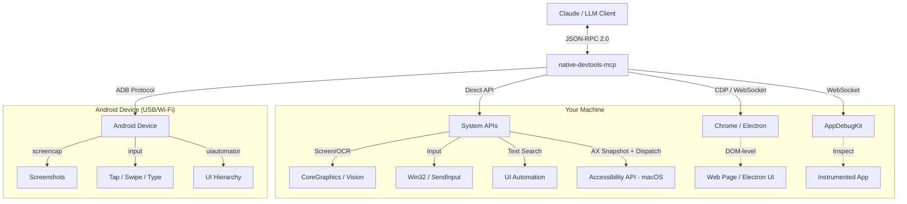

# native-devtools-mcp

> **An MCP server for computer use on native desktop and mobile apps — macOS, Windows, Android, and Chrome/Electron via CDP.**


`native-devtools-mcp` gives AI agents and MCP clients direct control over native desktop apps, Chrome/Electron browsers, and Android devices — screenshots, OCR, accessibility-first element lookup, input simulation, window management, Chrome DevTools Protocol (CDP), and ADB — all in one local server. Works with [Claude Desktop](https://claude.ai/download), [Claude Code](https://docs.anthropic.com/en/docs/claude-code), [Cursor](https://cursor.com), and other MCP-compatible clients.

## Quickstart

```bash
npx -y native-devtools-mcp
```

<div align="center">
<table>
<tr>
<td align="center"><strong>macOS</strong></td>
<td align="center"><strong>Windows</strong></td>
</tr>
<tr>
<td></td>
<td></td>
</tr>
</table>
</div>

---

## 🚀 Features

- **👀 Computer Vision:** Screenshots of screens, windows, or regions with built-in OCR (Vision on macOS, Windows Media OCR on Windows).
- **🖱️ Input Simulation:** Click, drag, scroll, type — global coordinates, window-relative, and screenshot-relative targeting.
- **🎯 Element-Precise AX Dispatch (macOS):** `take_ax_snapshot` → `ax_click` / `ax_set_value` / `ax_select` — dispatch against Accessibility-tree elements without moving the mouse or stealing focus. The preferred path for native macOS apps.
- **🌐 Browser Automation (CDP):** Chrome DevTools Protocol for Chrome and Electron apps (Signal, Discord, VS Code, Slack) — DOM-level click, fill, navigate, and JS evaluation without a separate Node.js server.
- **📱 Android (ADB):** Screenshots, uiautomator-based text lookup, input, and app management over USB or Wi-Fi.
- **🧩 Template Matching:** `load_image` + `find_image` for icons, toggles, and custom controls OCR can't identify.
- **🪟 Window Management:** List, focus, launch, and quit apps; record windows as timestamped JPEG frames.
- **🔍 Hover Tracking:** Observe user navigation patterns with dwell-filtered hover events — designed for LLMs watching a user work.
- **🔒 Local & Private:** 100% local execution. Screenshots and input never leave your machine.

## 🧭 Three Approaches to Interaction

Pick the approach that matches your target app.

| Approach              | Best for                                                                 | Key tools                                                               |
|-----------------------|--------------------------------------------------------------------------|-------------------------------------------------------------------------|
| **Visual** (universal)| Any app — games, Qt, custom renderers, anything without an AX tree       | `take_screenshot`, `find_text`, `click`, `type_text`, `find_image`      |
| **AX Dispatch** (macOS — *preferred for native macOS apps*) | AppKit / SwiftUI apps — System Settings, Finder, Mail, Xcode, Notes | `take_ax_snapshot`, `ax_click`, `ax_set_value`, `ax_select`             |
| **CDP** (Chrome / Electron) | Web content, Electron apps with `--remote-debugging-port`          | `cdp_connect`, `cdp_take_ax_snapshot`, `cdp_click`, `cdp_fill`          |

> For macOS native apps, **AX Dispatch is the preferred path** — it's element-precise, doesn't move the mouse, and doesn't steal focus. See the [Native App AX Dispatch recipe](./examples/native-app-ax-dispatch-flow.md).

There's also a fourth, niche path: **AppDebugKit** (`app_connect` / `app_query` / `app_click`) for apps instrumented with the AppDebugKit library. Mostly useful for developers testing their own apps.

## 🆚 How it compares

| Capability                                          | native-devtools-mcp | Playwright        | Claude Computer Use | pyautogui       |
|-----------------------------------------------------|:-------------------:|:-----------------:|:-------------------:|:---------------:|
| Native desktop apps                                 | ✅                  | ❌                | ✅ (screenshots)    | ✅ (coords)     |
| Web / DOM-level automation                          | ✅ (via CDP)        | ✅                | ❌                  | ❌              |
| Electron apps via CDP                               | ✅                  | Limited           | ❌                  | ❌              |
| Android devices (ADB)                               | ✅                  | ❌                | ❌                  | ❌              |
| Element-precise accessibility (no focus steal)      | ✅ (macOS)          | N/A (headless)    | ❌                  | ❌              |
| MCP protocol — works with any MCP client            | ✅                  | ❌                | Claude only         | ❌              |
| Local-only, no API key                              | ✅                  | ✅                | ❌ (needs API)      | ✅              |

## 📦 Installation

The install steps are identical on macOS and Windows.

### Option 1: Run with `npx` (no install needed)

```bash
npx -y native-devtools-mcp
```

### Option 2: Global install

```bash
npm install -g native-devtools-mcp
```

### Option 3: Build from source (Rust)

<details>
<summary>Click to expand build instructions</summary>

**Using the build script** (clones, builds, and runs setup):

```bash
curl -fsSL https://raw.githubusercontent.com/sh3ll3x3c/native-devtools-mcp/master/scripts/build-from-source.sh | bash
```

**Or manually:**

```bash
git clone https://github.com/sh3ll3x3c/native-devtools-mcp
cd native-devtools-mcp
cargo build --release
# Binary: ./target/release/native-devtools-mcp
```

</details>

### Manual configuration (without the setup wizard)

<details>
<summary>Click to expand MCP client config snippets</summary>

#### macOS — Claude Desktop

Config file: `~/Library/Application Support/Claude/claude_desktop_config.json`

```json
{
  "mcpServers": {
    "native-devtools": {
      "command": "/Applications/NativeDevtools.app/Contents/MacOS/native-devtools-mcp"
    }
  }
}
```

#### Windows — Claude Desktop

Config file: `%APPDATA%\Claude\claude_desktop_config.json`

#### Claude Code, Cursor, and other MCP clients

```json
{
  "mcpServers": {
    "native-devtools": {
      "command": "npx",
      "args": ["-y", "native-devtools-mcp"]
    }
  }
}
```

Requires Node.js 18+.

</details>

> **macOS permissions:** the server needs **Accessibility** and **Screen Recording** permissions. The setup wizard opens the right System Settings panes for you. Without both, clicks silently fail and screenshots return a black rectangle.

> **Linux is not supported yet.** The server uses platform-specific APIs (Core Graphics + Accessibility on macOS, Win32 + UI Automation on Windows) that don't exist on Linux. Contributions welcome — X11/Wayland screenshot, input, and AT-SPI paths would be a good first issue.

## 🏁 Getting Started

After installing, run the setup wizard:

```bash
npx native-devtools-mcp setup
```

This will:
1. **Check permissions** (macOS) — verifies Accessibility and Screen Recording, opens System Settings if needed.
2. **Detect your MCP clients** — finds Claude Desktop, Claude Code, and Cursor.
3. **Write the configuration** — generates the correct JSON config and offers to write it for you.

Then restart your MCP client and you're ready to go.

> **Claude Desktop on macOS** requires the signed app bundle (Gatekeeper blocks npx). Download `NativeDevtools-X.X.X.dmg` from [GitHub Releases](https://github.com/sh3ll3x3c/native-devtools-mcp/releases), drag to `/Applications`, then run setup — it will detect the app and configure Claude Desktop to use it.

> **VS Code, Windsurf, and other clients:** `setup` doesn't auto-detect these yet. Run `setup` for the permission checks, then see the manual configuration above for the JSON config snippet.

> **Claude Code tip:** To avoid approving every tool call (clicks, screenshots), add this to `.claude/settings.local.json`:
> ```json
> { "permissions": { "allow": ["mcp__native-devtools__*"] } }
> ```

### ⚠️ Operational safety

- **Hands off:** when the agent is "driving" (clicking / typing), don't move your mouse or type. Real hardware inputs conflict with simulated ones and clicks land in the wrong place.
- **Focus matters:** ensure the window you want the agent to use is visible. If a popup steals focus mid-flow, the agent may type into the wrong window unless it re-checks first.
- **Prefer AX Dispatch on macOS** when you want to keep using the machine — AX calls don't move the cursor and don't steal focus from whatever window is active.

## 📚 Recipes and Examples

- [Recipes Index](./examples/README.md)
- [Claude Desktop Setup](./examples/claude-desktop-setup.md) · [Claude Code Setup](./examples/claude-code-setup.md) · [Cursor Setup](./examples/cursor-setup.md)
- [End-to-End Desktop Flow](./examples/end-to-end-desktop-flow.md)
- [Native App AX Dispatch Flow (macOS)](./examples/native-app-ax-dispatch-flow.md) — **preferred for native macOS apps**
- [Native App Click Flow](./examples/native-app-click-flow.md)
- [OCR Fallback and Element Inspection](./examples/ocr-fallback-and-element-inspection.md)
- [Template Matching Flow](./examples/template-matching-flow.md)
- [Android Quickstart](./examples/android-quickstart.md)

## 🌐 Browser Automation (CDP)

Connect to Chrome or Electron apps via the Chrome DevTools Protocol for DOM-level automation — more reliable than coordinate-based clicking for web content.

```bash
# Launch Chrome with remote debugging
launch_app(app_name="Google Chrome", args=["--remote-debugging-port=9222", "--user-data-dir=/tmp/chrome-profile"])

# Connect and automate
cdp_connect(port=9222)
cdp_navigate(url="https://example.com")
cdp_take_ax_snapshot()        # accessibility tree with element UIDs (a1, a2, ...)
cdp_fill(uid="a10", value="search query")
cdp_press_key(key="Enter")
cdp_wait_for(text=["Results"])
```

**19 CDP tools** — snapshot (AX + DOM), find elements, click, hover, fill, type, press key, navigate, handle dialogs, manage tabs, evaluate JS, element inspection, and more. Works with Chrome 136+, Chromium, and Electron apps (Signal, Discord, VS Code, Slack). See [`AGENTS.md`](./AGENTS.md) for the full tool reference.

> **Chrome 136+ note:** requires `--user-data-dir=<path>` alongside `--remote-debugging-port` — Chrome silently ignores the debug port with the default profile. Electron apps only need `--remote-debugging-port`.

## 📱 Android Support

Android support is built-in. The server communicates with Android devices over ADB (USB or Wi-Fi), providing screenshots, input simulation, UI element search, and app management.

### Prerequisites

1. **ADB installed** on the host (`brew install android-platform-tools` on macOS, or via [Android SDK](https://developer.android.com/tools/releases/platform-tools)).
2. **USB debugging enabled** on the device (Settings > Developer options > USB debugging).
3. **ADB server running** — starts automatically when you run `adb devices`.

### Tools

All Android tools are prefixed with `android_` and appear dynamically after connecting to a device:

| Tool | Description |
|------|-------------|
| `android_list_devices` | List all ADB-connected devices (always available) |
| `android_connect` | Connect to a device by serial number |
| `android_disconnect` | Disconnect from the current device |
| `android_screenshot` | Capture the device screen |
| `android_find_text` | Find UI elements by text (via uiautomator) |
| `android_click` | Tap at screen coordinates |
| `android_swipe` | Swipe between two points |
| `android_type_text` | Type text on the device |
| `android_press_key` | Press a key (e.g., `KEYCODE_HOME`, `KEYCODE_BACK`) |
| `android_launch_app` | Launch an app by package name |
| `android_list_apps` | List installed packages |
| `android_get_display_info` | Get screen resolution and density |
| `android_get_current_activity` | Get the current foreground activity |

### Typical workflow

```
android_list_devices           → find your device serial
android_connect(serial="...")  → connect (unlocks android_* tools)
android_screenshot             → see what's on screen
android_find_text(text="OK")   → locate a button
android_click(x=..., y=...)    → tap it
```

<details>
<summary><strong>Known issues & advanced setup</strong></summary>

**MIUI / HyperOS (Xiaomi, Redmi, POCO devices):** input injection (`android_click`, `android_type_text`, `android_press_key`, `android_swipe`) and `android_find_text` (via uiautomator) require an additional security toggle:

> **Settings > Developer options > USB debugging (Security settings)** — enable this toggle. MIUI may require you to sign in with a Mi account to enable it.

Without this, you'll see `INJECT_EVENTS permission` errors for input tools and `could not get idle state` errors for `android_find_text`. Screenshot and device info tools work without this toggle.

**Wireless ADB:** to connect without a USB cable, first connect via USB and run:
```bash
adb tcpip 5555
adb connect <phone-ip>:5555
```
Then use the `<phone-ip>:5555` serial in `android_connect`.

**Smoke tests:** verify all Android tools against a real connected device. They are `#[ignore]`d by default:
```bash
cargo test --test android_smoke_tests -- --ignored --test-threads=1
```
Tests must run sequentially since they share a single physical device. The device must be unlocked and awake.

</details>

## 🔐 Security & Trust

This tool requires Accessibility and Screen Recording permissions — that's a lot of trust. Here's how to verify it deserves it.

### Verify your binary

```bash
native-devtools-mcp verify
```

Computes the SHA-256 hash of the running binary and checks it against the official checksums published on the [GitHub Releases](https://github.com/sh3ll3x3c/native-devtools-mcp/releases) page. If the hash matches, you're running an unmodified official build.

### Audit the code

[`SECURITY_AUDIT.md`](SECURITY_AUDIT.md) documents exactly which permissions are used, where in the source code, and includes an LLM audit prompt you can paste into any AI model for an independent security review.

### What this server does NOT do

- **No unsolicited network access.** The server never phones home. Network is only used when the MCP client explicitly invokes `app_connect` (WebSocket to a local debug server) or when you run the `verify` subcommand (fetches checksums from GitHub).
- **No file scanning.** Does not read or index your files. The only file reads are `load_image` (a path the MCP client explicitly provides) and short-lived temp files for screenshots (deleted immediately after capture).
- **No background persistence.** Exits when the MCP client disconnects.
- **No data exfiltration.** Screenshots are returned to the MCP client via stdout, never stored or transmitted elsewhere.

## ❓ FAQ

**Does it work on Linux?** Not yet — macOS, Windows, and Android only. The server uses Core Graphics + Accessibility APIs on macOS and Win32 + UI Automation on Windows. An X11/Wayland + AT-SPI port would be a welcome contribution.

**Does it need an API key?** No. The server runs entirely locally and makes no outbound API calls. Your MCP client may need its own LLM API key (Anthropic, OpenAI, etc.), but the server itself does not.

**How is this different from Claude Computer Use?** Claude Computer Use is an Anthropic feature locked to Claude models and works via screenshots + coordinates. `native-devtools-mcp` is model-agnostic (anything that speaks MCP — Claude, Gemini, GPT, local models via a bridge), runs locally, and adds element-precise macOS AX dispatch, Chrome DevTools Protocol, and Android over ADB.

**Does it work with local models (Ollama, LM Studio, etc.)?** Yes — as long as the client speaks MCP. Any MCP-compatible client can connect. Non-MCP clients can wrap the server behind a bridge.

**Is it free / open source?** Yes, MIT-licensed. See [`LICENSE`](./LICENSE).

**Does it record what I'm doing?** No — unless you explicitly call `start_recording`, which writes to a directory you specify and stops on `stop_recording`. Hover tracking likewise runs only while `start_hover_tracking` is active. Nothing is recorded or sent anywhere otherwise.

**How does it compare to Playwright or Puppeteer?** Those are browser-only. `native-devtools-mcp` covers native desktop apps and Android in addition to Chrome/Electron (via CDP). If you only need web automation, Playwright is mature and a better fit.

## 🏗️ Architecture



<details>
<summary><strong>🔧 Technical Details (Under the Hood)</strong></summary>

| OS | Feature | API Used |
|----|---------|----------|
| **macOS** | Screenshots | `screencapture` (CLI) |
| | Input | `CGEvent` (CoreGraphics) |
| | Text Search (`find_text`) | `Accessibility API` (primary), Vision OCR (fallback) |
| | AX Snapshot + Dispatch (`take_ax_snapshot` / `ax_click` / `ax_set_value` / `ax_select`) | Accessibility API — AX tree walk, `AXPress` action, `kAXValueAttribute` write, `AXSelectedRows` write (focus-preserving, no mouse movement) |
| | Element Inspection (`element_at_point`) | `AXUIElementCopyElementAtPosition` + AX tree walk fallback |
| | Hover Tracking (`start_hover_tracking`) | `CGEvent` cursor + Accessibility API polling |
| | Screen Recording (`start_recording`) | `CGWindowListCreateImage` at configurable fps |
| | OCR | `VNRecognizeTextRequest` (Vision Framework) |
| **Windows** | Screenshots | `BitBlt` (GDI) |
| | Input | `SendInput` (Win32) |
| | Text Search (`find_text`) | `UI Automation` (primary), WinRT OCR (fallback) |
| | Element Inspection (`element_at_point`) | `IUIAutomation::ElementFromPoint` |
| | Hover Tracking (`start_hover_tracking`) | `GetCursorPos` + UI Automation polling |
| | Screen Recording (`start_recording`) | `BitBlt` (GDI) at configurable fps |
| | OCR | `Windows.Media.Ocr` (WinRT) |
| **Android** | Screenshots | `screencap` / ADB framebuffer |
| | Input | `adb shell input` (tap, swipe, text, keyevent) |
| | Text Search (`find_text`) | `uiautomator dump` (accessibility tree) |
| | Device Communication | `adb_client` crate (native Rust ADB protocol) |
| **Chrome / Electron** | DOM-level automation | Chrome DevTools Protocol via `chromiumoxide` |

### Screenshot Coordinate Precision

Screenshots include metadata for accurate coordinate conversion:

- `screenshot_origin_x/y`: Screen-space origin of the captured area (in points)
- `screenshot_scale`: Display scale factor (e.g., 2.0 for Retina displays)
- `screenshot_pixel_width/height`: Actual pixel dimensions of the image
- `screenshot_window_id`: Window ID (for window captures)

**Coordinate conversion:**
```
screen_x = screenshot_origin_x + (pixel_x / screenshot_scale)
screen_y = screenshot_origin_y + (pixel_y / screenshot_scale)
```

**Implementation notes:**
- **Window captures** (macOS): uses `screencapture -o` which excludes window shadow. Captured dimensions match `kCGWindowBounds × scale` exactly, so click coordinates derived from screenshots land on intended UI elements.
- **Region captures:** origin coordinates are aligned to integers to match the actual captured area.

</details>

## 🪟 Windows Notes

Works out of the box on **Windows 10/11**.

- Uses standard Win32 APIs (GDI, SendInput).
- `find_text` uses **UI Automation (UIA)** as the primary search mechanism, querying the accessibility tree for element names. This is the same accessibility-first approach used on macOS. Falls back to OCR automatically when UIA finds no matches.
- OCR uses the built-in Windows Media OCR engine (offline).
- **Cannot interact with "Run as Administrator" windows** unless the MCP server itself is also running as Administrator.
- **Screen recording** uses GDI/BitBlt at configurable fps (default 5). For higher fps or game capture, DXGI Desktop Duplication API would provide hardware-accelerated capture — a planned future upgrade.

## 🤖 For AI Agents

Agent-oriented usage — intent definitions, schema examples, reasoning patterns — lives in [**`AGENTS.md`**](./AGENTS.md). It's a compact, token-optimized reference designed for ingestion by LLMs (Claude, Gemini, GPT, local models). If you're an AI agent reading this README to decide whether to use the server, go there next.

## ⭐ Star History

<a href="https://www.star-history.com/?repos=sh3ll3x3c%2Fnative-devtools-mcp&type=date&legend=bottom-right">
 <picture>
   <source media="(prefers-color-scheme: dark)" srcset="https://api.star-history.com/chart?repos=sh3ll3x3c/native-devtools-mcp&type=date&theme=dark&legend=bottom-right" />
   <source media="(prefers-color-scheme: light)" srcset="https://api.star-history.com/chart?repos=sh3ll3x3c/native-devtools-mcp&type=date&legend=bottom-right" />
   
 </picture>
</a>

## 📜 License

MIT © [sh3ll3x3c](https://github.com/sh3ll3x3c)
